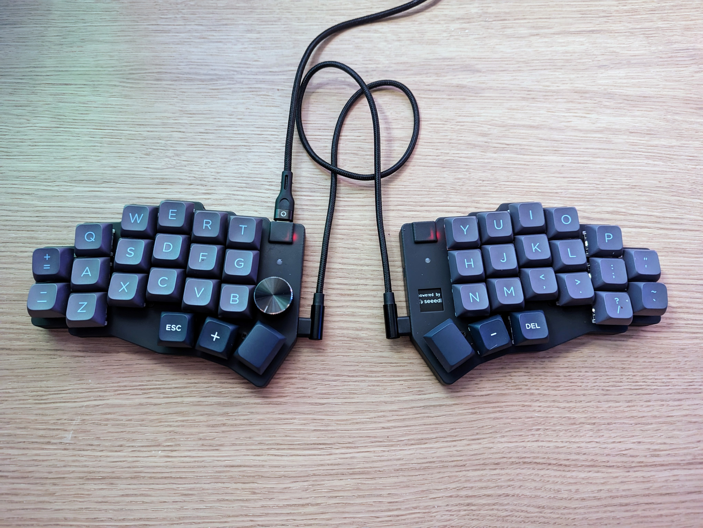
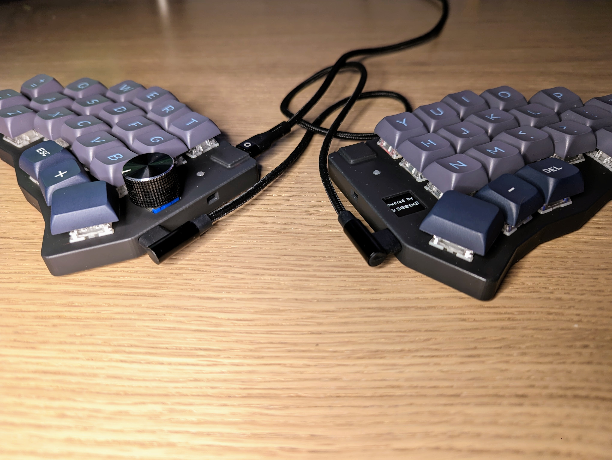
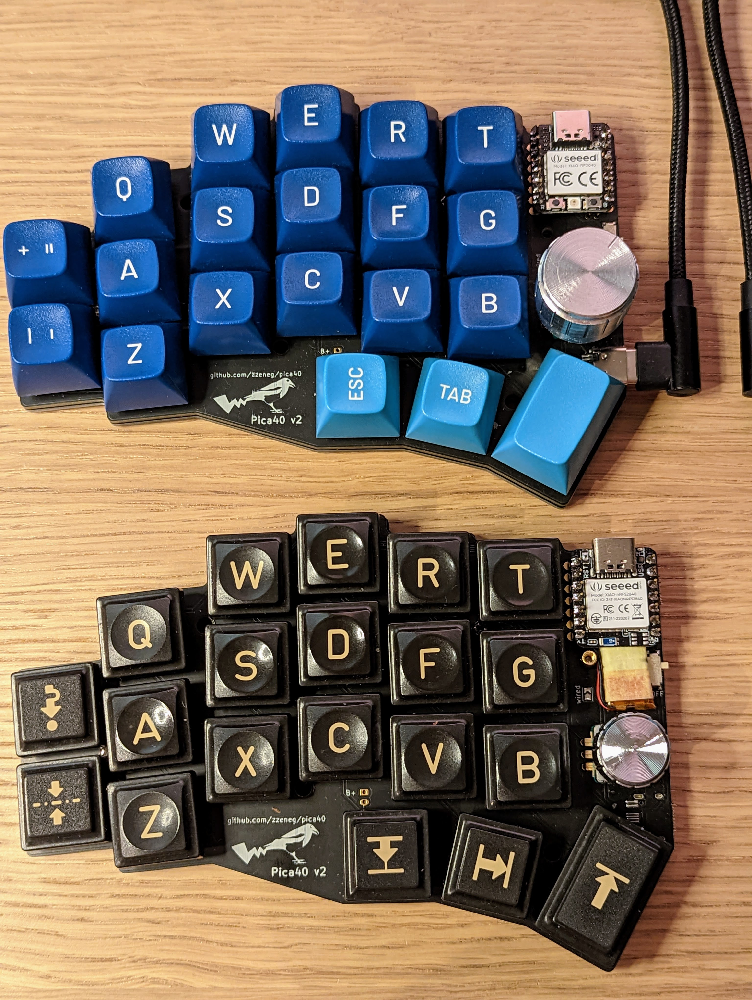
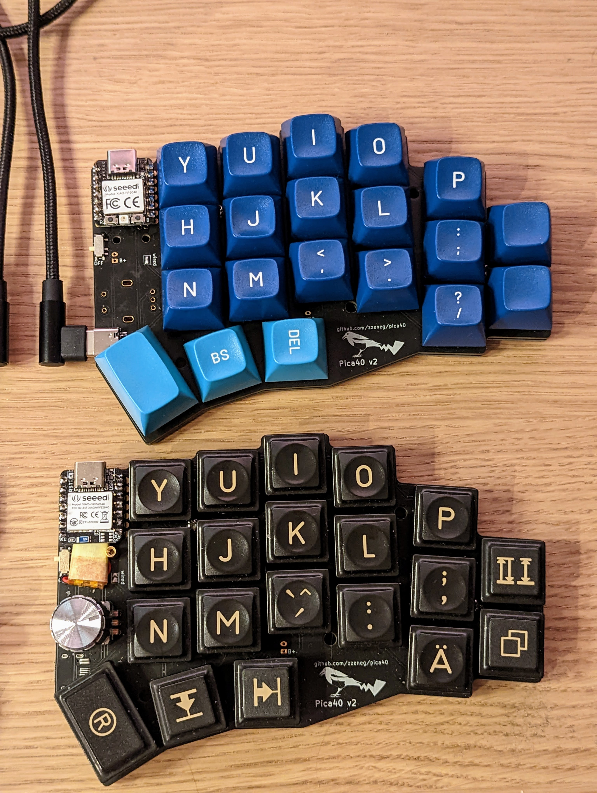

# Pica40 v2

Split keyboard with 40 keys using XIAO controllers.

_Pica pica - european (common) magpie_

## Features

- 40 keys
- high profile (regular MX switches with hotswap sockets) or low profile (soldered low-profile ChocV2 switches)
- wired/wireless versions
- aggressive stagger
- slightly splayed for pinky columns

### Wired version

- XIAO RP2040 controller
- QMK firmware
- USB-C or TRRS connection between splits
- one rotary encoder (without click)
- status LED

### Wireless version

- XIAO nRF52840 BLE controller
- ZMK firmware
- two rotary encoders (without click, only master side encoder is currently supported by ZMK)
- on/off toggle
- battery connectors

## Photos (V2 version)

wired version with 3d printed case

wired/wireless versions with Choc V2

Pica40 family - ChocV2 with low profile keycaps, ChocV2 with MT3 keycaps, Pica40 v1 with MT3 keycaps, regular switches and hotswap sockets

## Firmware

- QMK - available in [main repository](https://github.com/qmk/qmk_firmware/tree/master/keyboards/pica40), also check [my fork](https://github.com/zzeneg/qmk_firmware/tree/feature/pica40/keyboards/pica40) for most recent updates. [Compiled file](firmware/qmk/pica40_rev2.uf2).
- Vial - [my fork](https://github.com/zzeneg/vial-qmk/tree/feature/pica40/keyboards/pica40). [Compiled file](firmware/vial/pica40_rev2.uf2).
- ZMK - [Source code](https://github.com/zzeneg/zmk-config), [compiled left](firmware/zmk/pica40_left.uf2), [compiled right](firmware/zmk/pica40_right.uf2), [reset](firmware/zmk/settings_reset.uf2)

## Gerber files

- [PCB](gerbers/pcb.zip)
- [Bottom plate](gerbers/bottom.zip)

## Case files (STL - 3d printed, MX hotswap only)

Top:

- wired left [with](stl/top_case%20v7_left-wired.stl) encoder hole and [without](stl/top_case%20v7_left-wired-no-enc.stl)
- wired right [with](stl/top_case%20v7_right-wired.stl) encoder hole and [without](stl/top_case%20v7_right-wired-no-enc.stl)
- wireless [left](stl/top_case%20v7_left-wireless.stl) and [right](stl/top_case%20v7_right-wireless.stl)

Bottom:

- [Left](stl/bottom_case%20v10_left.stl) and [right](stl/bottom_case%20v10_right.stl)

## Case files (DXF - for metal/acrylic)

- [Bottom for MX hotswap with 3D printed case](dxf/bottom-curved.dxf)
- [Bottom for soldered ChocV2](dxf/bottom.dxf)

## Bill of materials

- PCBs
- 2 XIAO MCUs - [RP2040](https://www.seeedstudio.com/XIAO-RP2040-v1-0-p-5026.html) for wired version, [nRF52840](https://www.seeedstudio.com/Seeed-XIAO-BLE-nRF52840-p-5201.html) for wireless
- 40 SMD SOD-123 1N4148 diodes
- 1 or 2 EC11/12 rotary encoder with knob
- _[MX hotswap version]_ 3d printed case (top and bottom)
- _[MX hotswap version]_ 40 hotswap sockets
- _[MX hotswap version]_ 4mm M2 standoffs, 4-5mm M2 screws
- _[ChocV2 soldered version]_ FR4/metal/acrylic bottom plates
- _[ChocV2 soldered version]_ 6mm M2 screws, M2 nuts and washers
- _[ChocV2 soldered version]_ 6mm M2 screws, M2 nuts and washers
- _[Wired only]_ [USB-C 16pin connectors](https://www.aliexpress.com/item/1005003670899595.html)
- _[Wired only]_ [TRRS PJ-320A connectors](https://www.aliexpress.com/item/1005001928651798.html)
- _[Wireless only]_ [2x on/off toggle MSK-12C02](https://www.aliexpress.com/item/4000685483225.html)
- _[Wireless only]_ 2x Li-Ion 3.7V battery

## Build log

**TODO**

## Changelog

### V2.1

- added TRRS support
- wired version supports rotary encoder on any side
- remove all files for FR4/acrylic/metal sandwich case, 3D printing is better and cheaper
- improved 3D printed case with a new shape and parts

### V2

- reworked to true split with two XIAO MCUs controllers
- added splay to pinky columns
- all case/pcb files are not compatible with V1

### V1

- split with single Pro Micro based MCU and handwired connection
